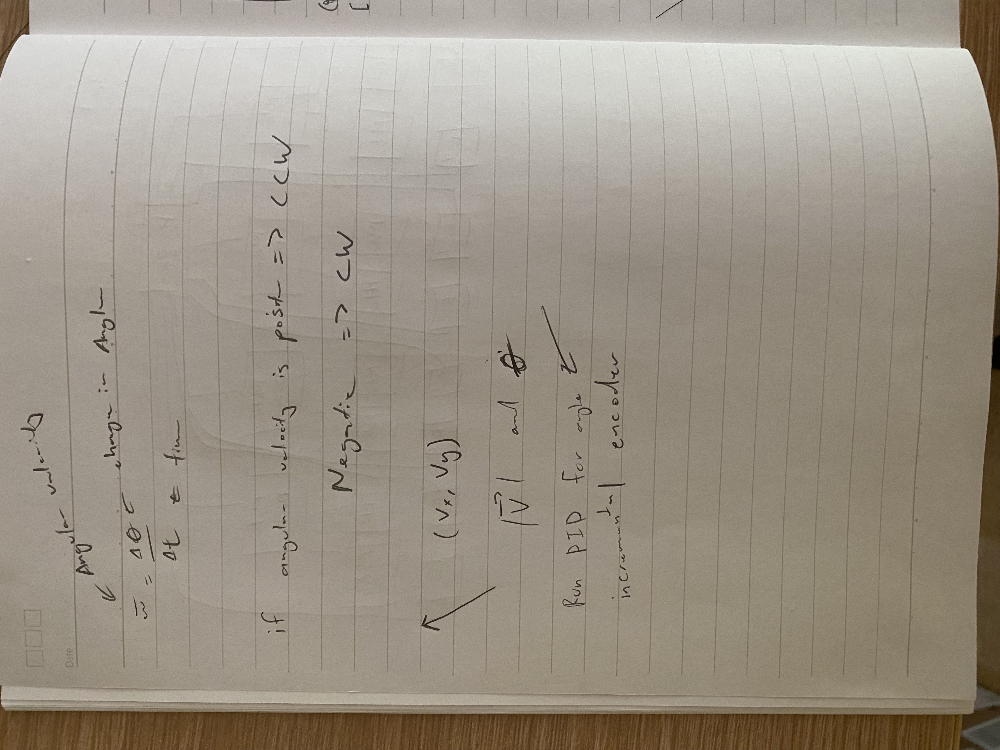

Time Spent: 20 hours

## June 23, 2025

New idea. Create a swerve drive that had odometry. I started by drawing different designs to see which ones were possible. I then did a simple cad to test if it would work. The cad took the longest because I had to figure out the best dimensions.

Time Spent: Around 1 hour

## June 24, 2025

I assembled the prototype. It worked pretty well. I had to fix some dimensions in the cad. I caded a bigger prototype that had more gears. I basically made one module of the swerve drivetrain. I also researched about the motors I was going to use. I wanted to have encoder to be more precise.

Time Spent: 2 hours

## June 25, 2025

I tested the second prototype and it worked pretty well. I spent the day cadding the whole robot. It took a lot of time trying to get all the joints working. The animations work and it looks pretty cool.

Time Spent: 5 hours

## June 26, 2025

I now focused more on the electronics. I started off my listing the BOM. Then, I made a power distribution diagram with the control diagram.

Time Spent: 1 hour

## June 27, 2025

I moved on to doing the schematic. I made the necessary symbols then started wiring the whole robot. Halfway through, I realized that the raspberry pi zero did not have enough GPIO pins so I had to switch to Arduino mega. This took way too long but it was needed to be done.

Time Spent: 3 hours

## June 28, 2025

Next, I went to the programming phase. I started by doing research and found this article. This gave me a fundamental understanding. Essentially, I have to add vectors. Finally an application of vectors. https://dominik.win/blog/programming-swerve-drive/

Time Spent: 2 hours

## July 1, 2025

The code is very long. I first declared all the electronics that were connected to the arduino mega. I then figured out how to add the vectors and make it have magnitude and direction. I then learned to use pid for the turning of each module. Lastly, I researched the code for using a ps4 controller to connect. 

Here are the sources I used:

https://github.com/PaulStoffregen/Encoder/blob/master/examples/Basic/Basic.ino
https://github.com/PowerBroker2/ArduPID/blob/main/examples/example/example.ino
http://brettbeauregard.com/blog/2011/04/improving-the-beginners-pid-introduction/
https://lastminuteengineers.com/l293d-dc-motor-arduino-tutorial/
https://maker.pro/arduino/projects/how-to-control-an-arduino-robot-with-a-ps4-bluetooth-controller

Time Spent: 5 hours

## Jun 21, 2025

I finalized the BOM and wrote the README.md

Time Spent: 1 hour 

Please note that the photos were taken after I completed the work, and the journal was written afterward. Some parts of the project may have carried over across multiple days. The recorded times are not entirely accurate... I actually spent more time, but noted conservative estimates.
