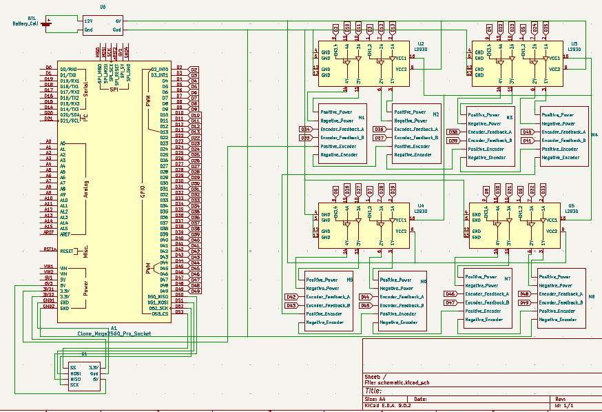

# Swerve

**Description:

** A swerve drivetrain completely 3D printed.

**Motivation for this project:** I wanted to make something similar to FRC swerve. I want to learn to program it.



Full CAD: https://a360.co/44cCmrA



## Demo:
https://youtube.com/shorts/nQBawvd5q3g?feature=share

## Pictures:






## BOM:

Purchase Items

| Item Name                  | What the Item Is For in Your Project                              | Item Source | Item Price (USD) | Quantity | Total Price (USD) | URL |
|---------------------------|---------------------------------------------------------------------|-------------|------------------|----------|--------------------|-----|
| Geared Motors w/ encoders | One for steering motor and the other for drive motor. Four Wheels. | Aliexpress  | 10.93            | 8        | 87.44              | [Link](https://www.aliexpress.com/item/4001314473291.html) |
| M4 - 45 Hex Head Bolts    | Transfer in power (check CAD)                                                                   | Aliexpress  | 2.81             | 1        | 2.81               | [Link](https://www.aliexpress.com/item/32968601031.html) |
| Bearings                  | For rotation of each module                                                                   | Aliexpress  | 13.29            | 2        | 26.58              | [Link](https://www.aliexpress.com/item/1005007420073930.html) |
| Arduino Mega              | Need more ports                                                    | Amazon      | 23.10            | 1        | 23.10              | [Link](https://www.amazon.ca/dp/B01H4ZLZLQ) |

**Total:** $149.96 USD

## Already Have

| Item           | What the Item Is For in Your Project | Source  | Quantity | URL |
|----------------|--------------------------------------|---------|----------|-----|
| Lipo Battery    | Power Robot                         | Amazon  | 1        | —   |
| L293D           | Motor Driver                        | Amazon  | 4        | —   |
| M3 - 8mm Bolts  | —                                   | Aliexpress | 1    | [Link](https://www.aliexpress.com/item/32810872544.html) |
| M4 - 40mm Bolts | —                                   | Aliexpress | 1    | [Link](https://www.aliexpress.com/item/32810872544.html) |
| M3 - 4mm Bolts  | —                                   | Aliexpress | 1    | [Link](https://www.aliexpress.com/item/32810872544.html) |
| ESP32  | —                                   | Amazon | 1    | -   |

